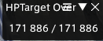

# HPTarget

A little plugin to directly check the number of HP left of the current target in game using Dalamud [FFXIVLauncher](https://github.com/goatcorp/FFXIVQuickLauncher).

To install it, you can follow this: [my repo](https://github.com/FeriusDMS/MyDalamudPlugins).

# open with

Well, it'll open automatically once you are on a target either ally or foe.